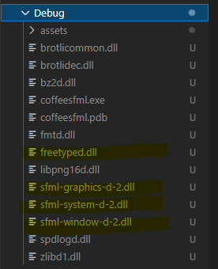
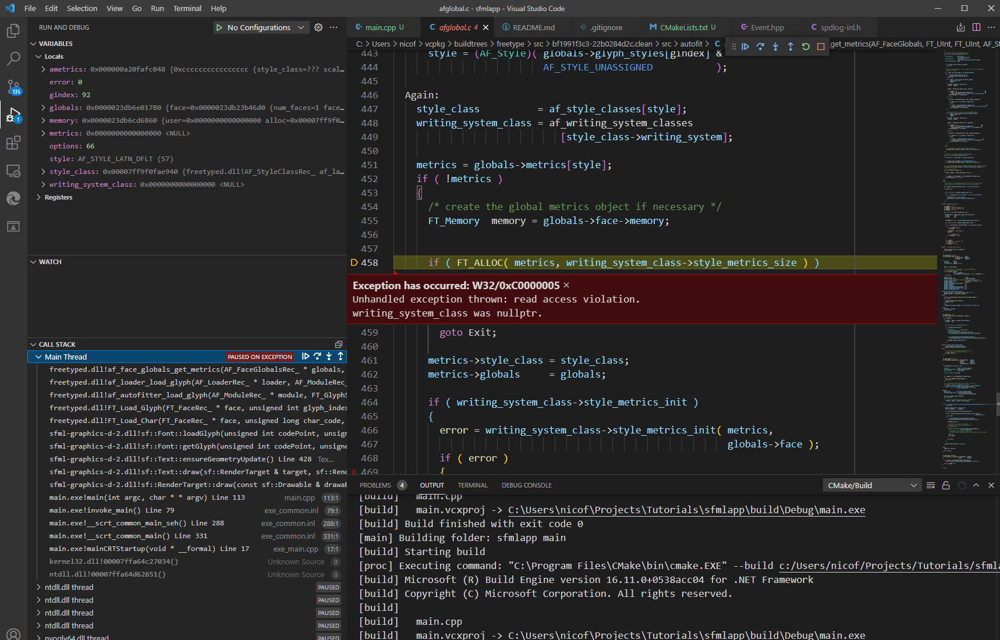
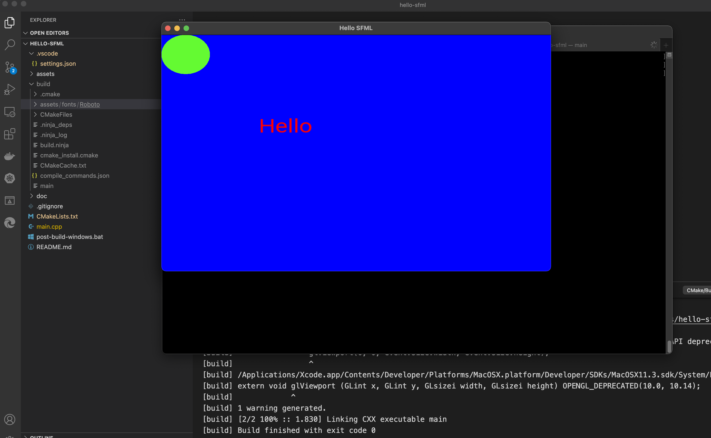

# Hello SFML

```
Launch VS Code
CMake Tools will configure assuming you have the following packages installed

sfml
spdlog
```

To install dependencies, run...vcpkg installs x86 by default

```
vcpkg install sfml
vcpkg install spdlog
```

If you need x64 (as used in this project)

```
vcpkg install sfml:x64-windows
vcpkg install spdlog:x64-windows
```

### Post build

On windows, you can run the post-build-windows.bat file

```
.\post-build-windows.bat
```

This will copy over the font assets into the `build/DEBUG/assets`

On Max/Linux, you can run the cp -r

```
cp -r assets build/Debug/assets
```

### Here is the result directory after a debug build



### Here is a screenshot of the crash that happens



### OSX

The build seems to work.


